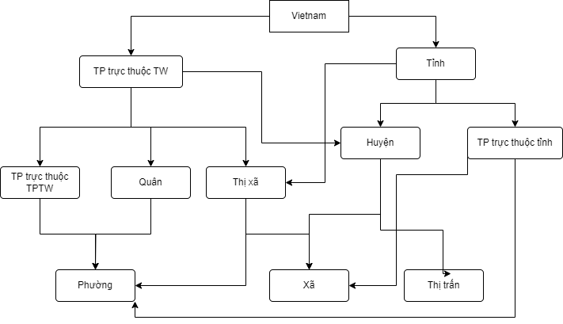
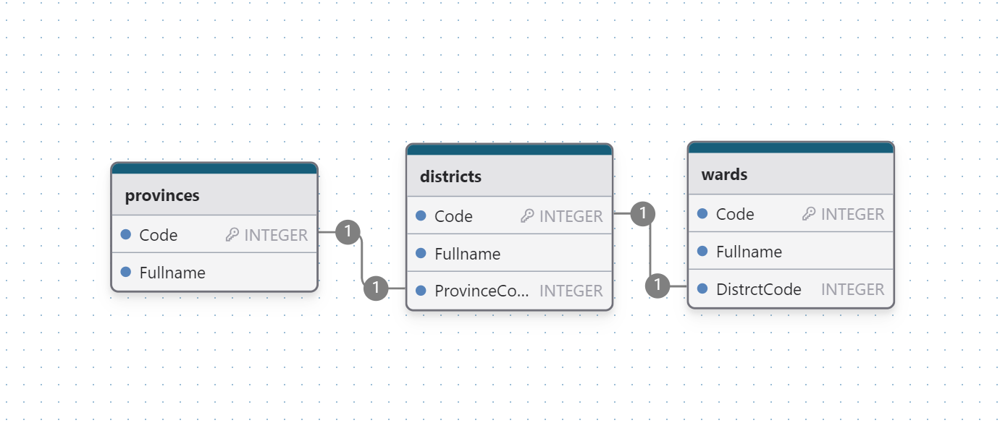

## Check valid information
Các case check logic:
+ **CMND/CCCD 12 số**
  + Kiểm tra quy tắc của số CMND, ngày hết hạn CMND
      - [x] id_not_follow_rule 
      - [x] invalid_expiry_date
      - [x] card_expired
  +  CMND được cấp trước năm Khách hàng đủ 13 
      - [x] incorrect_issue_date
  + Nguyên quán không tuân theo quy tắc trên CMND
      - [x] incorrect_native_place
  + Địa chỉ không tuân theo quy tắc trên CMND
      - [x] incorrect_native_place
  + Kiểm tra mặt trước và mặt sau của CMND/CCCD có dấu hiệu không phải của cùng một CMND/CCCD
      - [ ] not_in_same_card


### Json data CCCD mẫu
```
{
	"errorCode"  :  0,
	"errorMessage"  :  "",
	"data": [
		{
			"id":  "037203004898",
			"name":  "ĐINH HỮU HOÀNG",
			"dob":  "31/08/2003",
			"sex":  "Nam",
			"nationality":  "Việt Nam",
			"home":  "Khánh An, Yên Khánh, Ninh Bình",
			"address":  "Phúc Lộc, Phúc Thành, Thành phố Ninh Bình, Ninh Bình",
			"address_entities": {
				"province":  "Ninh Bình",
				"district":  "Thành phố Ninh Bình",
				"ward":  "Phúc Thành",
				"street":  "Phúc Lộc"
			},
			"doe":  "31/08/2028",
			"type":  "xxxx",
			"features":  "nốt ruồi",
			"issue_date":  "14/08/2021"
		}
		]
	}
```
Kết quả trả về gồm 11 trường thông tin:

|Trường|Mô tả|
|------|-----|
|id|Số CCCD|
|name|Tên|
|dob|Date of birth - Ngày tháng năm sinh|
|sex|Giới tính|
|nationality|Quốc gia|
|home|Quê quán|
|address|Địa chỉ|
|doe|Date of expire - Ngày hết hạn|
|features|Dấu vết, dị hình|
|issuse_date|Ngày cấp|

Phần Address sẽ được tách và chuẩn hóa thành 4 loại:
+ province
+ district
+ ward
+ street

Type gồm 4 loại:
+ old: mặt trước chứng minh nhân dân loại cũ 9 chữ số ID
+ old_back: mặt sau chứng minh nhân dân loại cũ 9 chữ số ID
+ new: mặt trước chứng minh nhân dân loại mới 12 chữ số ID hoặc căn cước công dân
+ new_back: mặt sau chứng minh nhân dân loại mới 12 chữ số ID hoặc căn cước công dân  

 ### 1. Kiểm tra Địa chỉ
- Mục đích: Kiểm tra xem dữ liệu về địa chính có hợp lệ không:
		+ Tỉnh không tồn tại
		+ Thành phố không xuất hiện trong tỉnh
		+ Phường không xuất hiện trong thành phố
	- Phương pháp:
		+ Dựng cơ sở dữ liệu của toàn bộ đơn vị hành chính Việt Nam, bao gồm **63 tỉnh thành** và các Quận huyện, phường xã liên quan.  Dữ liệu được cập nhật theo nghị định gần nhất: [1013/NQ-UBTVQH15](https://danhmuchanhchinh.gso.gov.vn/NghiDinh.aspx)
		+ Lược đồ quan hệ:
  

		+ Step:
		Địa chỉ trong CCCD tồn tại 4 cấp: Thôn < Xã/ Phường/ Thị trấn < Thành phố trực thuộc TPTW/ Quận/ Thị xã/ Huyện/ Thành phố trực thuộc tỉnh/  <  TPTW/ Tỉnh 
			1. Kiểm tra tỉnh có tồn tại hay không
			2. Kiểm tra thành phố có trong tỉnh không
			3. Kiểm tra phường có tồn tại trong thành phố hay không
			
### 2.  Kiểm tra Mã số CCCD
- Mục đích: Kiểm tra mã số CCCD hợp lệ và đúng thông tin không:
		+ Không đúng format (9 số, thiếu số, regex không hợp lệ)
		+ Mã tỉnh từ CCCD không hợp lệ
	- Phương pháp:
		+ Tạo regex để check formart của CCCD
		+ Quy tắc:
			1. 03 chữ số đầu tiên là mã tỉnh, thành phố trực thuộc trung ương hoặc mã quốc gia nơi công dân đăng ký khai sinh. từ (001 - 096)
			2. 01 chữ số tiếp theo là mã giới tính của công dân.
				- Thế kỷ 20 (từ năm 1900 đến hết năm 1999): Nam 0, nữ 1;
				- Thế kỷ 21 (từ năm 2000 đến hết năm 2099): Nam 2, nữ 3;
				- Thế kỷ 22 (từ năm 2100 đến hết năm 2199): Nam 4, nữ 5;
				- Thế kỷ 23 (từ năm 2200 đến hết năm 2299): Nam 6, nữ 7;
				- Thế kỷ 24 (từ năm 2300 đến hết năm 2399): Nam 8, nữ 9.
			3. 02 chữ số tiếp theo là mã năm sinh của công dân
			4. 6 chữ số cuối là khoảng số ngẫu nhiên.
		```
		r'^0([0-9]{2})([0-9])([0-9]{2})([0-9]{6})$
		```
- Step:
			1. Kiểm tra CCCD đọc vào đúng formart regex không
			2. Tách 3 ký tự đầu, kiểm tra tồn tại của tỉnh


### 3.  So khớp thông tin trích xuất từ Mã số CCCD với trường thông tin OCR
- Mục đích: Kiểm tra thông tin từ mã số CCCD có hợp lệ và giống với các trường thông tin được OCR không:
		+ Tỉnh
		+ Giới tính
		+ Năm sinh
		+ Quê quán
- Phương pháp: Tách thành 2 bộ dữ liệu với 2 nguồn khác nhau(Tỉnh, Giới tính, Năm sinh, Quê quán) rồi so khớp từng biến dữ liệu 1, nếu sai trả về mã lỗi, nếu phù hợp hết thì trả về True
- Step:
		+ Nếu hợp lệ thì so khớp 2 bộ dữ liệu, nếu khớp thì kiểm tra Vị trí Nguyên Quán và Quê Quán
		+ Dựng hàm kiểm tra thông tin Tỉnh từ phần 1, gọi 2 lần check Quê quán và Nguyên Quán xem có hợp lệ không
```
check_home_address = is_valid_address(province_home, district_home , ward_home)
    home_code_status = check_home_address[0]
    if home_code_status != 100:
        return 320, f"- ID Card: {id_ocr} - {check_home_address[1]}"
    

    check_valid_address = is_valid_address(province_Add_ocr, district_Add_ocr, ward_Add_ocr)
    addr1_code_status = check_valid_address[0]
    if addr1_code_status != 100:
        return addr1_code_status, f"- ID Card: {id_ocr} - {check_valid_address[1]}"
    

    extract_code_status, province, gender, yob = idCard_extract
    if not (province == province_Add_ocr and gender == sex_ocr and yob == year_ocr):
        return 310, f"ID Card: {id_ocr} Thông tin trích xuất từ ID card không trùng với OCR (Tỉnh, Giới tính, Năm Sinh)"
    
    extract_code_status = idCard_extract[0]
    if extract_code_status!=200:
        return extract_code_status, f"ID Card: {id_ocr} is invalid"
```
	
 ### 4. Kiểm tra DateTime
- Mục đích: Kiểm tra dữ liệu về thời gian có hợp lệ không bao gồm:
	+ [x] Ngày hợp lệ
	+ [x] YOB không hợp lệ: Tháng 6 có 31 ngày, xuất hiện tháng 14,…
	+ [x] DOE không hợp lê
	+ [x] Issue Date không hợp lệ
	+ [x] Năm sinh lớn hơn năm hiện tại hoặc ngày cấp lớn hơn năm hiện tại
	+ [x] CCCD hết hạn
	+ [x] Chưa đủ 18 tuổi
	+ [x] Ngày hết hạn không hợp lệ
- Quy tắc kiểm tra:
	+ Căn cước công dân được cấp từ khi đủ 14 đến trước 23 tuổi sẽ hết hạn vào năm 25 tuổi. 
	+ Căn cước công dân được cấp từ khi đủ 23 đến trước 38 tuổi sẽ hết hạn vào năm 40 tuổi. 
	+ Căn cước công dân được cấp từ khi đủ 38 đến trước 58 tuổi sẽ hết hạn vào năm 60 tuổi.
	+ Căn cước công dân từ khi đủ 58 tuổi trở đi sẽ được sử dụng cho đến khi người đó chết (trừ trường hợp thẻ bị mất hoặc hư hỏng).
- Step:
	+ Tạo 2 hàm kiểm tra: Ngày hợp lệ - Đúng quy tắc BCA:
	+ Hàm kiểm tra ngày:
```
def is_valid_date(date_string):
    try:
        # Định dạng ngày tháng năm là dd/mm/yyyy
        datetime.strptime(date_string, "%d/%m/%Y")
        return 410, f"Ngày hợp lệ"
    except ValueError:
        return 411, f"Ngày không hợp lệ"
    
def is_valid_date(date_string):
    try:
        # Định dạng ngày tháng năm là dd/mm/yyyy
        datetime.strptime(date_string, "%d/%m/%Y")
        return 410, f"Ngày hợp lệ"
    except ValueError:
        return 411, f"Ngày không hợp lệ"

def validate_dates(dates):
    for date, error_code, error_message in dates:
        check = is_valid_date(date)
        if check[0] != 410:
            return error_code, error_message
    return None
```
+ Hàm Kiểm tra quy tắc
```
def check_vali_datetime(yob, doe, yoi):
    if(yoi - yob < 14):
        return 415, f"Ngày cấp nhỏ hơn 13 tuổi"
    if(yob > current_year or yoi > current_year):
       return 401, f"Year of birth or Issue date is invalid"
    else:
        if( doe < current_year ):
            return 402, f"Date of expiry is invalid"
        else:
            if(current_year - yob <18):
                return 403, f"Chưa đủ 18 tuổi"
            else:
                age_at_issue = yoi - yob
                expected_doe = None
                
                if 14 <= age_at_issue < 23:
                    expected_doe = yob + 25
                elif 23 <= age_at_issue < 38:
                    expected_doe = yob + 40
                elif 38 <= age_at_issue < 58:
                    expected_doe = yob + 60
                elif age_at_issue >= 58:
                    if doe is None:  # Không có ngày hết hạn
                        return 400, "Date valid."
                    else:
                        return 405, "Căn cước công dân không có ngày hết hạn sau 58 tuổi."
                if expected_doe == doe:
                    return 400, "Date valid"
                else:
                    return 405, "Ngày hết hạn không hợp lệ."
```
		
## Status Code
|Status code|Description|
|----------------|-------------------------------|
|**300**| **Trường thông tin hợp lệ**|
|**100**|**Địa chỉ hợp lệ: {ward_name}, {district_name}, {city_name}**|
|101|{ward_name}' không tồn tại trong quận '{district_name}' của thành phố '{city_name}'"            |
|102|"Quận '{district_name}' không tồn tại trong thành phố '{city_name}'"|
|103|"Thành phố '{city_name}' không tồn tại|
|**200**|**ID extract trả ra thông tin hợp lệ**|
|210|Formart Regex ID hợp lệ|
|211|Formart regex ID không hợp lệ|
|212|3 số đầu trong CCCD không tồn tại mã tỉnh|
|310|Thông tin trích xuất từ ID card không trùng với OCR (Tỉnh, Giới tính, Năm Sinh)|
|320|Thông tin quê quán không chính xác|
|**400**|**Date valid**|
|410|Ngày hợp lệ|
|412|YOB không hợp lệ: Tháng 6 có 31 ngày, xuất hiện tháng 14,..|
|413|DOE không hợp lê|
|414|Issue Date không hợp lệ|
|415|Ngày cấp nhỏ hơn 13 tuổi|
|401| Năm sinh lớn hơn năm hiện tại hoặc ngày cấp lớn hơn năm hiện tại|
|402|CCCD hết hạn|
|403|Chưa đủ 18 tuổi|
|405|Ngày hết hạn không hợp lệ|

### Demo, run test
```
python validate.py
```
